# Credit Risk Analysis

The task at hand is to use Machine Learning to identify a candidate model to predict loans that are high risk. As high risk loans are less prevalent, this imbalance is reflected in the data set. The approach will be to use various resampling techniques to compensate for the imbalance, then using a Logistics Regression model, evaluate the results and recommend a candidate model, if any. 

Two addtional models suited for imbalanced data sets will be evaluated as well, Balanced Random Forest and Ensemble AdaBoost Classifier. 

## The Data Set

Data set size is significant, 68817 rows, but extremly unbalanced. There are 2 target values with following percentage : high_risk : 347 (0.5%), low_risk : 68470 (99.5%) 

Pre-processing: All categorical features will be converted to numeric. Constant categorical features will be dropped. Categorical features with only 2 values will be converted values 0/1 in a single column. Categorical features with more than 2 values are converted with the get_dummies feature of pandas.

## Approach 1 - Oversampling

1 __Random Oversampling Results__
- Balanced Accuracy Score : 0.644
- Confusion Matrix 
    - 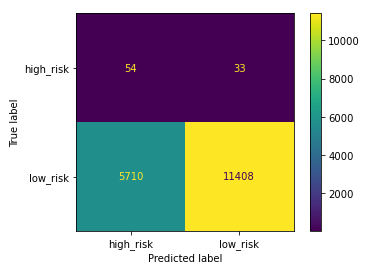
- Classification report
    - 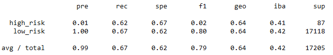

2 __Synthetic Minority Over-sampling (SMOTE)__
- Balanced Accuracy Score : 0.625
- Confusion Matrix 
    - 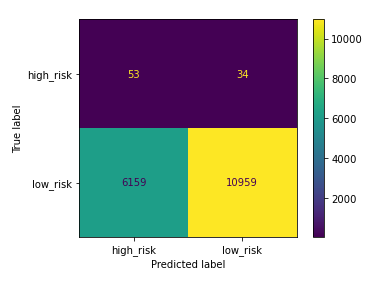
- Classification report
    - 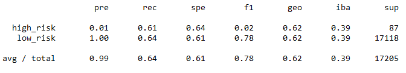

## Approach 2 - Undersampling

1 __Random Undersampling Results__
- Balanced Accuracy Score : 0.59
- Confusion Matrix 
    - 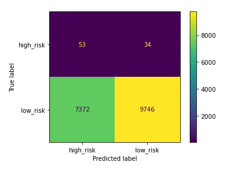
- Classification report
    - 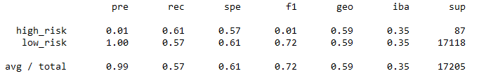

## Approach 3 - Combination Oversampling and Undersampling

1 __Cluster Centroids Results__
- Balanced Accuracy Score : 0.53
- Confusion Matrix 
    - 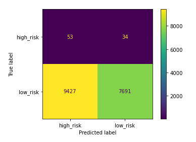
- Classification report
    - 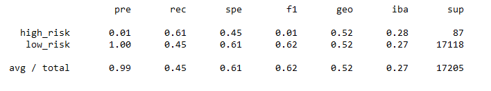

## Approach 4 - Ensemble Learners

1 __Balanced Random Forest Classifier__
- Balanced Accuracy Score : 0.778
- Confusion Matrix 
    - 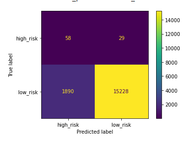
- Classification report
    - 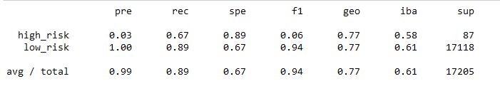
- Top 10 Features and percentages
    - 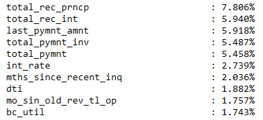

2 __Easy Ensemble AdaBoost Classifier__
- Balanced Accuracy Score : 0.926
- Confusion Matrix 
    - 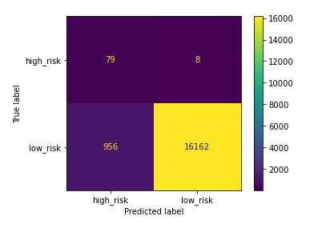
- Classification report
    - 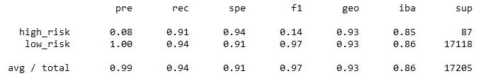

## Summary

All of the re-sampling techniques had poor results in balanced accuracy, precision and recall. Precision for high risk loans was near zero and recall for both high and low risk loans was relatively low, between 0.45 and 0.65. Using the ensemble methods, there is a marked improvement in recall for both high and low risk loans, but precision for high risk loans is still near 0. 

Using the current data set and sampling methods, none of the models are suitable for predicting a high risk loan. Given a high risk loan, the Easy Esemble model can be used to confirm the status of high risk with a good accuracy. 

Next steps, using the results for feature importance from the Balanced Random Forest model, consider further evaluation of the models dropping some features of lower importance. 